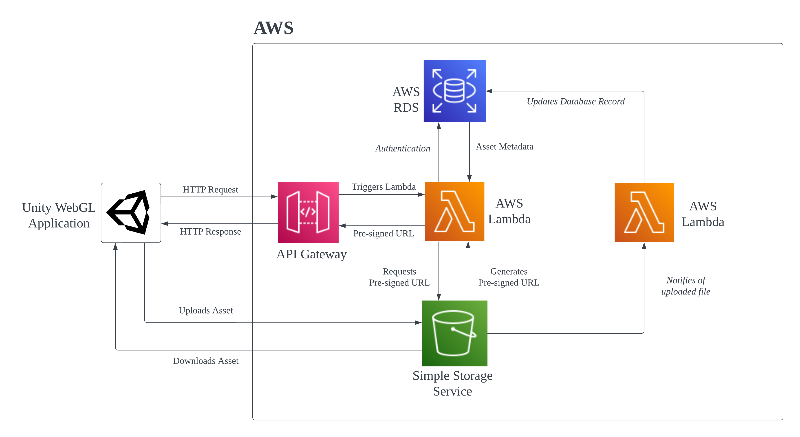
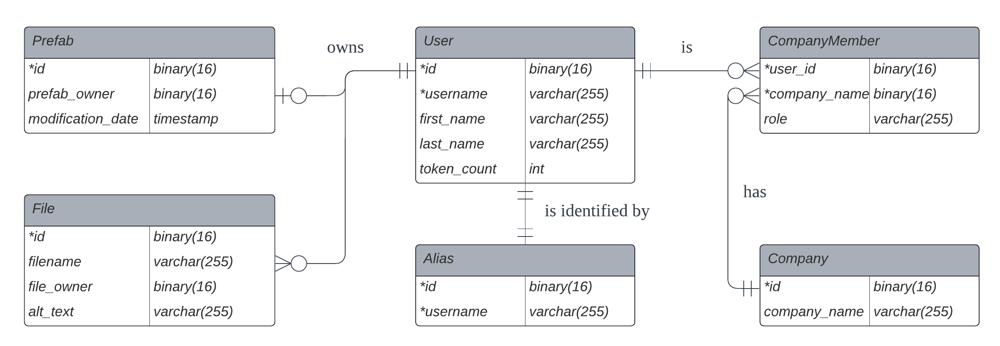

# iUROP Metanoia Backend
### Backend prototype for the Metanoia project. Singapore University of Technology and Design iUROP submission.

## API
The API hosted in AWS is now accessible. You may find the documentation [here](https://documenter.getpostman.com/view/19779478/2s8479xGEC)

## System Architecture

## Database Schema

## Procedure of Prefab Uploads/Downloads
### Uploading a Prefab
1. Application sends a PUT HTTP Request to API Gateway.
2. API Gateway triggers the Lambda Function.
3. Lambda function generates a temporary *presigned url* to allow to upload the prefab asset file directly to the S3 Bucket.
4. The presigned URL is returned in the HTTP response.
5. The application uploads the asset file directly to the S3 Bucket.
6. Once the prefab asset file has been uploaded, the S3 Bucket triggers another Lambda function.
7. The Lambda function updates the database records and allocated the new prefab to the uploading user. *This ensures that the database records are consistent with the S3 Bucket.*

### Downloading a Prefab
1. Application sends a GET HTTP Request to API Gateway.
2. API Gateway triggers the Lambda Function.
3. Lambda queries the database to find the prefab file id for the given user.
3. Lambda function generates a temporary *presigned url* to allow to download the prefab asset file directly from the S3 Bucket.