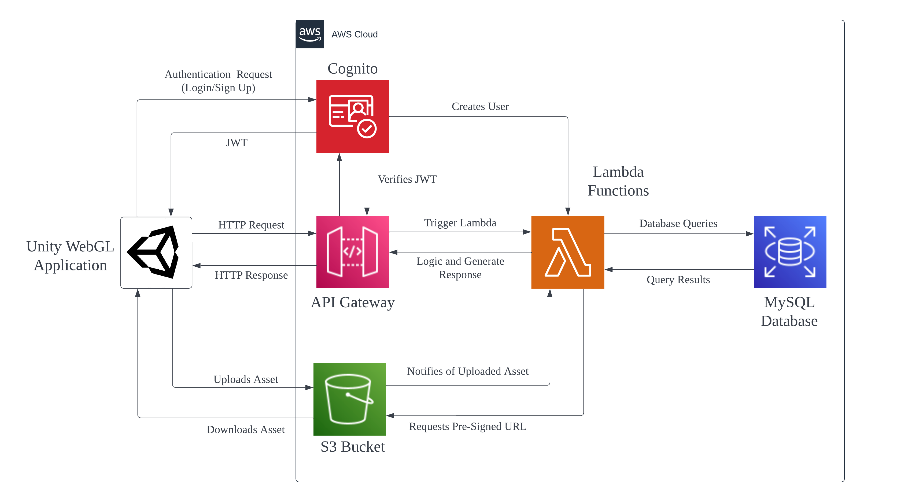

# iUROP Metanoia Backend
### Backend prototype for the Metanoia project. Singapore University of Technology and Design iUROP submission.

## API Documentation
The API hosted in AWS is now accessible. To see the up to date list of endpoints and instructions for usage please consult the documention. You may find the documentation [here](https://documenter.getpostman.com/view/19779478/2s8479xGEC).

## System Architecture

Services in use:
* Lambda
* API Gateway
* S3
* MySQL RDS
* Cognito

## Database Schema
